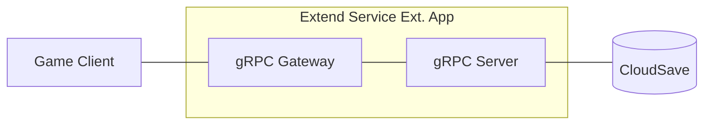

# energy-service-extension



An `Extend Service Extension` app built on `AccelByte Gaming Services` (AGS) that provides an **energy system** for games. It manages player energy — including regeneration, consumption, refilling, and inventory — backed by AGS CloudSave.

## Overview

This service exposes RESTful endpoints (via gRPC Gateway) for:

- **Get Energy** — retrieve the player's current energy with auto-regeneration calculation
- **Consume Energy** — deduct energy for an in-game action (e.g. plant, harvest, craft)
- **Refill Energy** — add energy from a source (e.g. purchase, reward, daily bonus)
- **Get Inventory** — retrieve the player's collected items
- **Get/Update Energy Config** — read or update max energy and regeneration rate

All public endpoints require a valid AGS user access token. Admin endpoints are also available for backend/server-to-server use.

Swagger UI (when running locally): `http://localhost:8000/energy-based-game/apidocs/`

## Project Structure

```shell
.
├── main.go                         # App entry point
├── pkg
│   ├── common
│   │   ├── authServerInterceptor.go    # gRPC auth interceptor (token + permission validation)
│   │   └── ...
│   ├── pb                              # Generated gRPC stubs from service.proto
│   │   └── ...
│   ├── proto
│   │   ├── service.proto               # gRPC + HTTP gateway + permission definitions
│   │   └── ...
│   ├── service
│   │   ├── energyService.go            # Energy service business logic
│   │   └── ...
│   └── storage
│       └── storage.go                  # CloudSave storage layer
└── ...
```

## Prerequisites

1. Windows 11 WSL2 or Linux Ubuntu 22.04 or macOS 14+ with the following tools installed:

   a. Bash

   b. Make

      - On Windows WSL2 or Linux Ubuntu: `sudo apt update && sudo apt install make`

   c. Docker (Docker Desktop 4.30+/Docker Engine v23.0+)

      - On Linux Ubuntu: `sudo apt update && sudo apt install docker.io docker-buildx docker-compose-v2`
      - On Windows or macOS: [Docker Desktop](https://docs.docker.com/desktop/)

   d. Go v1.23+

      - Follow [Go's installation guide](https://go.dev/doc/install).

   e. [extend-helper-cli](https://github.com/AccelByte/extend-helper-cli)

      - Download the binary from [releases](https://github.com/AccelByte/extend-helper-cli/releases).

2. Access to an AGS environment.

   a. Base URL (e.g. `https://dev.accelbyte.io`)

   b. A Game Namespace with active status.

   c. A **Confidential OAuth Client** with the following permissions:

      | Resource | Action |
      |---|---|
      | `ADMIN:ROLE` | Read |
      | `ADMIN:NAMESPACE:{namespace}:NAMESPACE` | Read |
      | `ADMIN:NAMESPACE:{namespace}:CLOUDSAVE:RECORD` | Create, Read, Update, Delete |
      | `ADMIN:NAMESPACE:{namespace}:EXTEND:APP` | Read *(required for deployment only)* |

## Setup

1. Copy `.env.template` to `.env`:

   ```shell
   cp .env.template .env
   ```

2. Fill in the required values in `.env`:

   ```
   AB_BASE_URL=https://your-environment.accelbyte.io
   AB_CLIENT_ID=xxxxxxxxxx
   AB_CLIENT_SECRET=xxxxxxxxxx
   AB_NAMESPACE=xxxxxxxxxx
   PLUGIN_GRPC_SERVER_AUTH_ENABLED=true
   BASE_PATH=/energy-based-game
   ```

   > :exclamation: Set `PLUGIN_GRPC_SERVER_AUTH_ENABLED=false` to disable token validation for local development without credentials.

## Running

```shell
docker compose up --build
```

The service will be available at:
- HTTP Gateway: `http://localhost:8000`
- Swagger UI: `http://localhost:8000/energy-based-game/apidocs/`
- Metrics: `http://localhost:8080/metrics`

## Testing

1. Get a user access token via the AGS IAM OAuth2 endpoint or Postman.

2. Open Swagger UI at `http://localhost:8000/energy-based-game/apidocs/`.

3. Click **Authorize** and enter `Bearer <user_access_token>`.

4. Try the endpoints.

## Deploying

1. **Create an Extend Service Extension app** in the AGS Admin Portal if you don't have one.

   Note the `Namespace` and `App Name`. Under **Environment Configuration**, set:
   - `AB_CLIENT_ID`
   - `AB_CLIENT_SECRET`

2. **Build and push the container image** using [extend-helper-cli](https://github.com/AccelByte/extend-helper-cli):

   ```shell
   AB_CLIENT_ID=<admin-client-id> AB_CLIENT_SECRET=<admin-client-secret> AB_BASE_URL=<base-url> \
   extend-helper-cli image-upload --login --namespace <namespace> --app <app-name> --image-tag v0.1.0
   ```

   > :warning: The client used here must have `ADMIN:NAMESPACE:{namespace}:EXTEND:APP [READ]` permission. This is typically a separate admin client, not the service's own client.

3. **Deploy** from the Admin Portal:
   - Go to the App Detail page → **Image Version History**
   - Select the pushed image tag → **Deploy Image**
